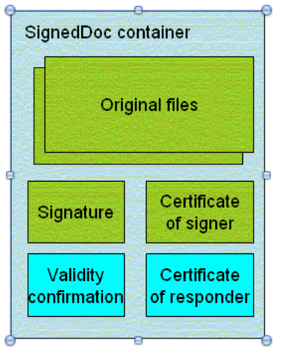
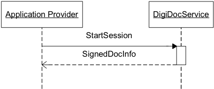
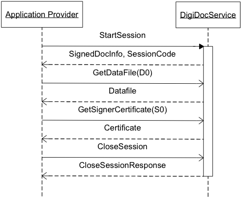
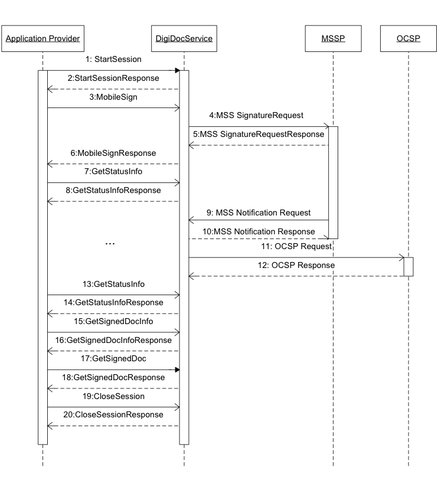
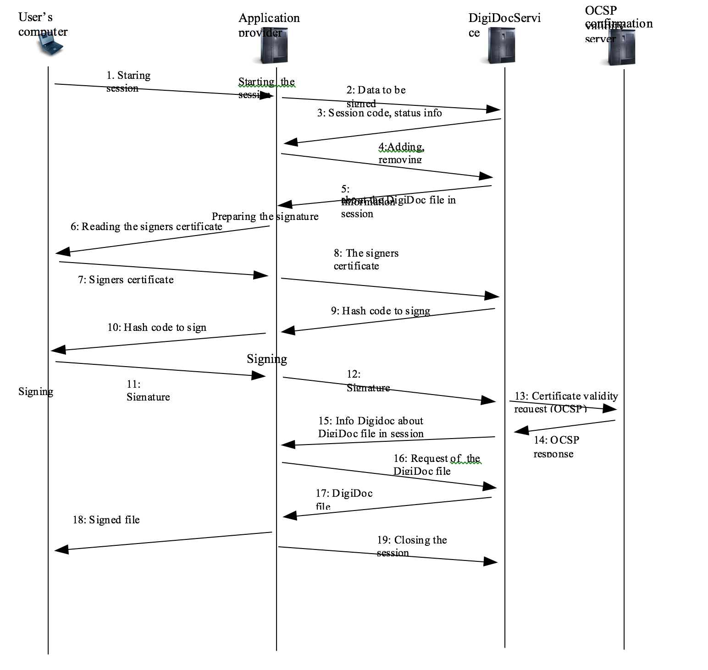
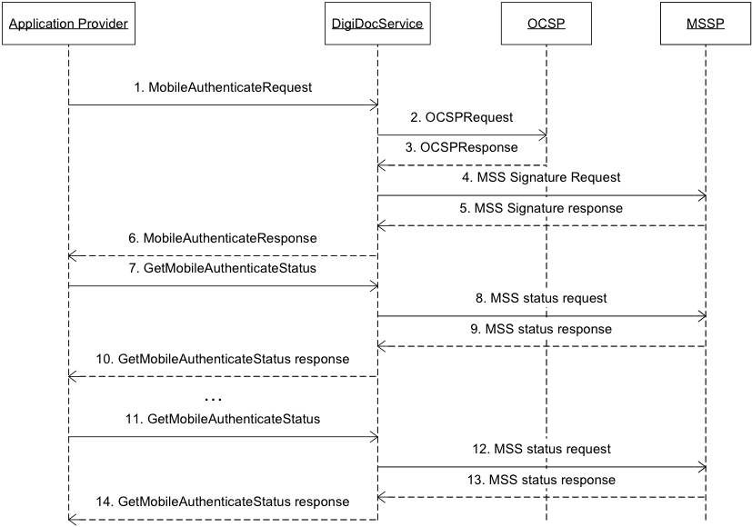

# SK ID Solutions AS DigiDocService specification

>**NB!**
>``DigiDocService`` will be ``replaced`` by new ``Mobile-ID REST API`` during 2019/2020. 
>From ``October 1, 2020``, the service will no longer be available for use. Please use new Mobile-ID REST API!
>
>``Mobile-ID REST API specification`` you can find here: [https://github.com/SK-EID/MID/wiki](https://github.com/SK-EID/MID/wiki)

## Table of contents

<!---
1. Document Versions        
1. References        
--->

* [Introduction]()        
    * [Formats of digitally signed files](#formats-of-digitally-signed-files)        
        * [DDOC format](#ddoc-format)        
        * [BDOC format](#bdoc-format)       
    * [Signing algorithms](#signing-algorithms)        
* [Terms and Acronyms](#terms-and-acronyms)        
* [Suggestions and requirements for Application providers](##suggestions-and-requirements-for-application-providers)        
    * [Digital signing](#digital-signing)        
    * [Starting Mobile-ID operations](#starting-mobile-id-operations)        
    * [Technical suggestions and requirements](#technical-suggestions-and-requirements)        
* [Main use cases](#main-use-cases)        
    * [Verification of the digitally signed file](#verification-of-the-digitally-signed-file)        
    * [Signing](#signing)        
        * [Mobile Signing in Asynchronous Client-Server mode](#mobile-signing-in-asynchronous-client-server-mode)        
        * [Signing with smartcard](#signing-with-smartcard)        
    * [Authentication](#authentication)        
        * [Mobile authentication in asynchronous Client-Server mode](#mobile-authentication-in-asynchronous-client-server-mode)        
        * [Authentication using smartcard](#authentication-using-smartcard)        
* [Authentication API](api/api_docs/#authentication-api)
    * [MobileAuthenticate](api/api_docs/#mobileautheticate)
    * [GetMobileAuthenticateStatus](api/api_docs/#getmobileauthenticatestatus)
    * [CheckCertificate](api/api_docs/#checkcertificate)
* [Digital Signature API](api/api_docs/#digital-signature-api)
    * [StartSession](api/api_docs/#startsession)
        * [HASHCODE](api/api_docs/#hashcode)
    * [CloseSession](api/api_docs/#closesession)
    * [CreateSignedDoc](api/api_docs/#createsigneddoc)
    * [AddDataFile](api/api_docs/#adddatafile)
    * [MobileSign](api/api_docs/#mobilesign)
    * [GetStatusInfo](api/api_docs/#getstatusinfo)
    * [GetSignedDocInfo](api/api_docs/#getsigneddocinfo)
    * [GetSignedDoc](api/api_docs/#getsigneddoc)
    * [GetDataFile](api/api_docs/#getdatafile)
    * [RemoveDataFile](api/api_docs/#removedatafile)
    * [RemoveSignature](api/api_docs/#removesignature)
    * [GetSignersCertificate](api/api_docs/#getsignerscertificate)
    * [GetNotarysCertificate](api/api_docs/#getnotaryscertificate)
    * [GetNotary](api/api_docs/#getnotary)
    * [GetVersion](api/api_docs/#getversion)
    * [PrepareSignature](api/api_docs/#preparesignature)
    * [FinalizeSignature](api/api_docs/#finalizesignature)
    * [MobileCreateSignature](api/api_docs/#mobilecreatesignature)
    * [GetMobileCreateSignatureStatus](api/api_docs/#getmobilecreatesignaturestatus)
    * [GetMobileCertificate](api/api_docs/#getmobilecertificate)
    * [MobileSignHash](api/api_docs/#mobilesignhash)
    * [GetMobileSignHashStatusRequest](api/api_docs/#getmobilesignhashstatusrequest)
* [Data structures](api/api_docs/#data-structures)
    * [SignedDocInfo](api/api_docs/#signeddocinfo)
    * [CertificateInfo](api/api_docs/#certificateinfo)
    * [DataFileInfo](api/api_docs/#datafileinfo)
    * [SOAP Error Messages](api/api_docs/#soap-error-messages)
    * [Container validation](api/api_docs/#container-validation)
* [Service Change History](#service-change-history)

# Introduction

DigiDoc is a SOAP-based web service enabling an easy integration for the functionality of digital signing, verifying signatures and authentication with other information systems.

The service is usable in different development environments and platforms featuring SOAP 1.0-encoded support.

**Functionality of the service:**

* Authentication with Mobile-ID
* Verification of certificate's validity (including any smartcard)
* Creation of DigiDoc/BDOC files
* Digital signing of DigiDoc/BDOC with Mobile-ID
* Digital signing of DigiDoc/BDOC with ID card (and other smartcards)
* Verification of digitally signed files (DigiDoc/BDOC) and validity of signatures
* Hash signing with Mobile-ID.

Access to the service is created on the basis of an IP address. A contract with SK ID Solutions AS needs to be signed for using the service. The price of using the DigiDocService 
depends on the number of signature and authentication queries per month and on the number of concurrent queries coming from one application.

DigiDocService supports DigiDoc container formats ``DIGIDOC-XML 1.3`` and ``BDOC 2.1`` with ``time-marks``. BDOC with ``time-stamps`` (``BDOC-TS``, ``ASiC-E``) format is supported since version 3.8 for 
using ``MobileCreateSignature`` method. Validation of BDOC-TS file format is supported starting from 3.9. Since 3.10 BDOC-TS is fully supported, i.e. support was added for following methods: ``CreateSignedDoc``, ``AddDataFile``, ``RemoveDataFile``, ``RemoveSignature``, ``PrepareSignature``, ``FinalizeSignature``, ``MobileSign``.

Older formats (``SK-XML 1.0``, ``DIGIDOC-XML 1.1`` and ``DIGIDOC-XML 1.2``) are only supported for verification (document container format is checked in the ``MobileCreateSignature`` and ``CreateSignedDoc`` methods). 
If an inappropriate combination of given format and version number is used in request parameters, a SOAP error object with error message "Invalid format and version combination" will be returned.

##  Formats of digitally signed files

###  DDOC format

The format of the digitally signed file is based on ETSI TS 101 903 standard called "XML Advanced Electronic Signatures (XAdES)". This standard provides syntax for digital 
signatures with various levels of additional validity information.

In order to comply with the security model described above, the XAdES profile of "XAdES-X-L" is used in the DigiDoc system but "time-marks" are used i
nstead of "time-stamps" – signing (and certificate validation) time comes with OCSP response.

**This profile:**

* Allows for incorporating following signed properties
    * Certificate used for signing
    * Signing time
    * Signature production place
    * Signer role or resolution
* Incorporates full certificate validity information within the signature
    * OCSP response
    * OCSP responder certificate

As of result, it is possible to verify signature validity without any additional external information – the verifier should trust the issuer of signer's certificate and a OCSP responder certificate.

Original files (which were signed) along with the signature(s), validation confirmation(s) and certificates are encapsulated within container with "SignedDoc" being as a root element.

DigiDoc system uses file extension. ``ddoc`` to distinguish digitally signed files according to the described file format.

Syntax of the ``.ddoc`` files is described in the separate document [3] DigiDoc Format Specification in detail.

###  BDOC format

In addition starting from version 3.5 DigiDocService also supports BDOC 2.1 _with__time-marks_ (BDOC-TM). BDOC _with time-stamps_ (BDOC-TS, ASiC-E) format is supported since version 3.8 for using MobileCreateSignature method. Validation of BDOC-TS container format is supported starting from 3.9 and since 3.10 BDOC-TS is fully supported, i.e. added support for following methods: CreateSignedDoc, AddDataFile, RemoveDataFile, PrepareSignature, FinalizeSignature, MobileSign, RemoveSignature.

 The description of BDOC file format is available in BDOC specification [9].

Starting from 2015 BDOC is default digital signature format in Estonia, therefore it's important to add BDOC file format support to your service. For more information about BDOC file format, please visit [http://www.id.ee/?id=34336](http://www.id.ee/?id=34336)

Instructions for DigiDocService service users on how to migrate to BDOC format are available at id.ee website: [http://www.id.ee/?lang=en&id=37072](http://www.id.ee/?lang=en&id=37072) .

## Signing algorithms

DigiDocService supports signatures using the ECDSA (Elliptic Curve Digital Signature Algorithm) and RSA algorithms.

The service automatically chooses the appropriate algorithms for signing and authentication. To learn which algorithm is 
used in a particular case, application providers should inspect the certificate returned by the service.

ECDSA is currently only supported for Mobile-ID. If user's SIM card does not have ECDSA support, RSA algorithm is used. 
For DDOC file format only RSA is supported, BDOC format supports RSA and ECDSA.

A single signer can have multiple active certificates, each with a different signing algorithm. In such cases, 
DigiDocService chooses the most suitable certificate automatically.

The choice is based on following conditions:

- if user's SIM-card supports ECDSA, authentication (operation MobileAuthenticate) is always done using the ECDSA certificate.
- If user's SIM-card supports ECDSA and RSA, then ECDSA is used for signing BDOC files (operation MobileSign and MobileCreateSignature). As the DDOC file format does not support ECDSA, DDOC files are always signed using RSA.

For SIM cards that support both ECDSA and RSA the GetMobileCertificate method **by**** default** returns the ECDSA certificate; similarly, the MobileSignHash method chooses ECDSA. But starting from version 3.9 it is possible to request ECDSA (ECC) or RSA certificate.

RSA is commonly used with either 1024-bit or 2048-bit keys. ECDSA is implemented over the NIST P-256 [8] curve and the signatures are encoded according to the XMLDSig specification [10] (i.e., two 256-bit integers appended to each other, zero-padded on the left if necessary; the result is then converted to Base64). The total raw ECDSA signature size is always 512 bits.

## Terms and Acronyms

* **Application Provider** - Client of the DigiDocService, provides an application that uses digital signing, signature verification and/or authentication. 
*  **Control Code** - 4-digit number used in mobile authentication and mobile signing which is cryptographically linked with hash value to be signed. Control Code is displayed both in mobile phone and computer application in order to provide for authenticity of the signing request. 
* **Hash, Hash value** - Data to be signed which is cryptographically derived from Datafiles and other parameters to be signed 
* **Mobile-ID** - Service based on Wireless PKI providing for mobile authentication and digital signing. Mobile-ID user uses special SIM card with private keys on it. Hash to be signed is sent over the mobile network to the phone and the user shall enter PIN code to perform transaction. The signed result is sent back to the service. 
* **MSSP** - Mobile Signature Service Provider. Described in standard ETSI TS 102 204 [6]. 
* **Original file, Datafile** - File to be digitally signed. The file is in arbitrary file format 
* **Signing** - Used in this case as „forming the digital signature" according to the Digital Signature Law. The procedure includes besides signing the validity confirmation request. 
* **Verification** - Checking the validity of signatures of the digitally signed data. 
* **Transaction, session** - Communication while a file (DigiDoc or the original data file) is forwarded to the web service and some operations related to these are followed, i.e. a DigiDoc is created out of the data file, then signed and returned to the application. After closing the transaction all the information created during the transaction is deleted from the service-server |

# Main use cases

## Verification of the digitally signed file

In need of verifying a digitally signed document the easiest way is to use the StartSession request (described in [StartSession](api/api_docs#startsession)) valuing the SigDocXML parameter. If the only purpose is getting the overview of the content of DigiDoc and no further signing or certificate reading is intended, the StartSession request should be called with the parameter bHoldSession value set to false. In this case no further session closing is necessary. The StartSession request returns the signed document information as a structure of SignedDocInfo, where all the necessary parameters the signed document are readable.

If StartSession is called with parameter bHoldSession=true, after verifying it some additional requests about signed document will be possible:

- to request the information about a data file (GetDataFile method)

- to request the certificate of a certain signer (GetSignerCertificate method)

- to request the validity confirmation response for a certain signature (GetNotary method)

-to request the validity confirmation signer's certificate of a certain signature (GetNotaryCertificate method)

If StartSession is called with parameter bHoldSession=true, further session closing will be necessary.

## Signing

### Mobile Signing in Asynchronous Client-Server mode

1. Application provider sends the files for signing (DigiDoc files or original files) to DigiDoc Service within the StartSession request.
2. As a result of the StartSession request also a created session identifier is returned, what should be used in the headers of following requests.
3. The application sends a MobileSign request to start the signing process. If there's a will to sign more than one original file at a time, it's possible to add additional data files with AddDataFile method before sending the MobileSign request.
4. DigiDocService forwards the signing request to MSSP service, which forwards it in turn to user's phone via a mobile operator.
5. MSSP returns either an errorcode or an information about successful request.
6. DigiDocService returns a response to the application with the MobileSign request. The response is either an errorcode or the information about the signing request.
7. In asynchronous Client-Server mode the application should keep up sending a GetStatusInfo request to DigiDocService until signing process is either successful or unsuccessful.
9. MSSP service sends a note about succeeding/unsucceeding. If signing is successful, also a signature will be sent to the DigiDocService.
2. DigiDocService returns the information about receiving the signature to MSSP.
3. After receiving the signature DigiDoc service sends a request about the user certificate's validity to the OCSP validity confirmation service.
4. The validity confirmation service returns a signed validity confirmation response. A signature, which contains a signed hash and the validity confirmation service response is added to the DigiDoc file in session.
5. Another GetSignedDocInfo request is sent by the Application Provider.
6. DigiDocService returns GetStatusInfoResponse about success or failure of signing operation
7. Application provider request information about document status using GetSignedDocInfo method
8. DigiDocService responds to GetSignedDocInfo
9. The application provider inquires the content of the signed DigiDoc with GetSignedDoc request.
10. DigiDocService returns a DigiDoc file to the application. If the content of the data files is not sent to the service within the StartSession, the application that uses the service has to add it to the DigiDoc container itself.
11. The application closes the session with sending a CloseSession request to the service.
12. The Service returns the CloseSession response.

### Signing with smartcard

The present example is based on the web-page enabling digital signing.

1. User of the digital signing application has chosen a procedure that requires data signing. The user starts the signing procedure pressing the respective button or hyperlink in a company web service.
1. The data meant to be signed will be sent to DigiDocService by StartSession request. A new session is initiated with that. Every session is connected to a (digitally signed) document. But every digitally signed document may contain plenty of original files.

An application sends to the service either

1. a file to be signed
2. the meta information and the hash of the file to be signed (the content of the file has been removed)
3. the entire container to be signed
4. the container to be signed without the bodi(es) of datafile(s) (all the content between the DataFile tags has been removed)

The ways of sending the data necessary for signing are described more precisely in [StartSession](api/api_docs#startsession). Data received within the StartSession request is saved in the session.

1. SessionCode is returned to the application, what enables the following procedures with the session data.
2. Before signing the application may add supplementary data files (AddDataFile request) or remove some datafiles (RemoveDataFile request) or carry out some other procedures with session data.
3. After procedures the current session document information is returned.
4. The signing modules are integrated in the webpage which offers digital signing. Also some information about the signer's role/resolution and the signing location may be asked the user on the webpage. The signing component located on the webpage reads the signer's certificate information from the smartcard. It is recommended to use Javascript library hwcrypto.js for loading signature modules - available from [github.com](https://github.com/hwcrypto/hwcrypto.js/releases)
5. The certificate from the signer's smartcard together with other user inserted signature attributes is forwarded to the signing web-server.
6. Signature parameters are forwarded to DigiDocService with PrepareSignature request.
7. DigiDocService adds new signature information to the session document – signer's certificate and signature parameters and calculates the hash, what should be signed by the signer. The signed hash is sent to the application provider in PrepareSignature response.
8. The hash to be signed together with the signing module is displayed to a user. The user presses the signing button on the webpage. As the result of that the signing module signs the hash (also asks for the PIN-code).

The created signature is set to the hidden field of the form and sent to the web-page which offers the signing functionality.

1. The signature is forwarded to the signing web-server (application provider).
2. The signature is forwarded to DigiDocService with FinalizeSignature request.
3. DigiSocService makes a validity confirmation request about the validity of the signer's certificate to the OCSP validity service.
4. OCSP validity confirmation server returns the validity confirmation of the signature.
5. If the confirmation is positive (i.e. the signer's certificate is valid), SK web-service adds the entire information (the signature and the validity 
   confirmation of the signer) to the creatable digital signature. From now on the digital signature is consistent added to the DigiDoc in session. 
   DigiDocService returns the digital signing application the SignedDocInfo.
6. Application asks for the content of the DigiDoc file with GetSignedDoc request.
7. DigiDocService returns the current DigiDoc document which also contains the added signature.
8. The user is informed about the happy end in digital signing. A digitally signed DigiDoc file is ready for download.

NB! In case that the content of the data file was not sent to servers within StartSession and AddDataFile requests (described in options b and d), it's necessary to add the bodies of data files to DigiDoc file received from the service. TheContentType has to be changed in <DataFile> tag, the reference to hash has to be removed and the contents of data files in Base64 encoding has to be added between <DataFile> tags. If possible the validity of signatures and the integrity of file is checked.

1. The last step for the signing application is to close the session with CloseSession request. After that the service deletes all the data saved within the session.

## Authentication

### Mobile authentication in asynchronous Client-Server mode

1. The Application Provider sends data required for the authentication to DigiDocService using MobileAutheticate (personal identification code, text to be displayed, language)
2. DigiDocService makes a validity confirmation request about the validity of the user's certificate to the OCSP service.
3. OCSP validity confirmation server returns the validity confirmation of the certificate. If the certificate is valid, go to p. 4, otherwise to p. 6.
4. An authentication request is sent to the user's mobile phone through the MSSP service.
5. MSSP responses with information about successfulness of message delivery to the mobile phone
6. If the certificate was valid and delivery of the authentication message through MSSP was successful, information about the end-user is returned to the Application provider. Otherwise, error message is returned.
7. Application Provider will periodically query the Service with GetMobileAuthenticateStatus request. (Note: this is a case for Asynchronous Client-Server Mode; in other mode the Application Provider will just wait for information from the Service).
8. DigiDocService in turn will query MSSP
9. MSSP responses on status of the query
10. Information about authentication status is forwarded to the Application Provider.
11. 13. 14 etc - this loop (7. 8. 9. 10.) goes on until positive answer or error message will arrive.

### Authentication using smartcard

CheckCertificate method can be used as a part of authentication with ID-card, checking the validity of user authentication certificate (located on the smartcard).

# Suggestions and requirements for Application providers

## Digital signing

Application provider shall guarantee the following:

- According to the Digital Signature Act passed in the Estonian parliament, a digital signature solution must make it possible to:
1) unambiguously identify the person who owns the signing certificate;

2) identify the time of signing;

3) connect the digital signature with the signed data in a way that makes it impossible to undetectably change the signed data or its meaning after signing.

- The user is informed about the legal consequences of the digital signature before entering PIN2 (i.e., the PIN used for digital signatures).
- Measures are implemented to guarantee a single interpretation of signed data.
- The user shall have the possibility to be sure in the authenticity of the signed data and the attributes added to the signature (place of signing, role/resolution) should they be used.
- The data presented to the user before signing is in compliance with the actual data to be signed.
- The user shall have access to the digitally signed file which is created after the digital signing. Note that this applies to any operation that uses PIN2.  For example, when signing online payments on a web site, the signer must be allowed to access the signed container after signing. This allows the signer to verify contents of the signed data.

## Starting Mobile-ID operations

Mobile-ID operations (mobile authentication and mobile signing) can be started using DigiDocService methods:

* MobileAuthenticate,
* MobileSign and
* MobileCreateSignature 

All those methods accept Mobile-ID user's Personal Identification Code and phone number as input parameter.

If you would like to provide Mobile-ID operations for Lithuanian Mobile-ID users in your application then both input parameters are mandatory: user's Personal Identification Code and phone number. Otherwise the request fails.

> **NB!** It is highly recommended to use both input parameters - Mobile-ID user's Personal Identification Code and phone number also for 
> Estonian Mobile-ID users. The requirement is planned to be turned obligatory in the future.

Using only phone number is not recommended when security is a concern, because phone numbers are public and Mobile-ID users may get spammed.

**Using both Personal Identification Code and phone number:**

* When user makes a mistake when entering either his/her Personal Identification Code or phone number, it's very unlikely that Mobile-ID request will appear in another unintended Mobile-ID user's phone.
* Spamming is complicated because Personal Identification Codes are not public
* The user does not necessarily have to enter such data directly: for example, a user name could be tied to a particular combination of personal identification code and a phone number.

It's mandatory for application providers to prevent spamming (by IP-restrictions or by using input parameters mentioned above), otherwise SK ID Solutions AS must limit access to DigiDocService, to guarantee that DigiDocService stays up and running for other application providers that use it.

Application, that enables users to authenticate or digitally sign documents using Mobile-ID, must clearly present challenge number (ChallengeID parameter in MobileAuthenticate response, see below) to user and warn user to check if challenge number presented by application is the same as challenge number on mobile phone screen. If challenge numbers differ, Mobile-ID operation has to be cancelled.

Challenge number should be correctly implemented and highly visible also when Mobile-ID operations are used from Mobile device browser.

## Technical suggestions and requirements

- Web applications, that enable authentication or digital signing using Mobile-ID or ID-card, should use encrypted channel (HTTPS) between browser and web server.
- Mobile-ID-enabled web applications, when polling regularly DigiDocService with requests about operation state information (whether user has already entered his/her PIN number and signing/authenticating is completed or not), should, for usability reasons, not reload web page every time request is made to DigiDocService – using Ajax is recommended.
- The file size is limited to 4 MB. [StartSession](api/api_docs#startsession) describes how to send larger-scale files to the Service.

# Service Change History

Service changes' history can be found at [https://github.com/SK-EID/dds-documentation/wiki/Change-log](https://github.com/SK-EID/dds-documentation/wiki/Change-log)

1. Information about canonic XML: [http://www.w3.org/TR/xml-c14n](http://www.w3.org/TR/xml-c14n)
